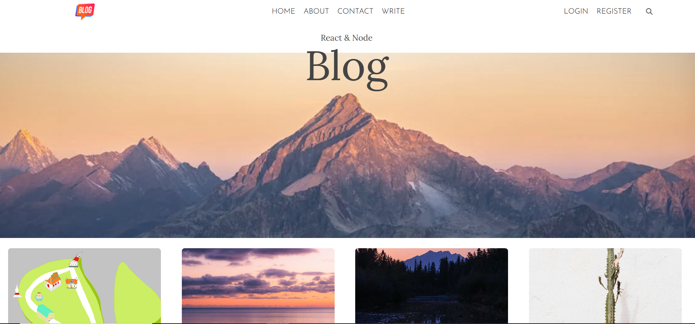

# **Blog Website**  

A blog website built with the MERN stack, offering a secure and user-friendly platform for creating, managing, and exploring blog posts.  

---

## **Features**  
- 🔒 **Secure Authentication**  
  - User login and registration system implemented for secure access.  

- 📝 **Blog Management**  
  - Users can **create**, **edit**, **delete**, and **view** blog posts effortlessly.  
  - Rich-text editor for enhanced blog post formatting.  

- 🌐 **Image Upload and Management**  
  - Integrated cloud storage (e.g., **multer**) for uploading and managing images within blog posts.  

---

 
